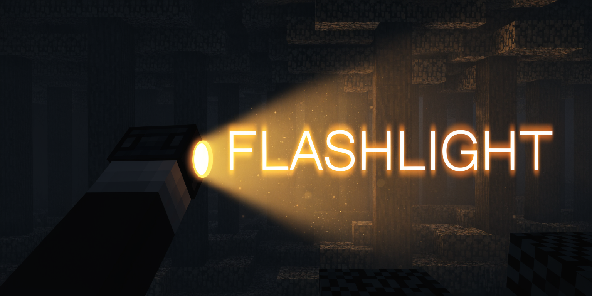
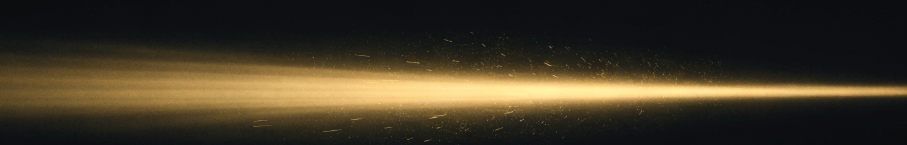
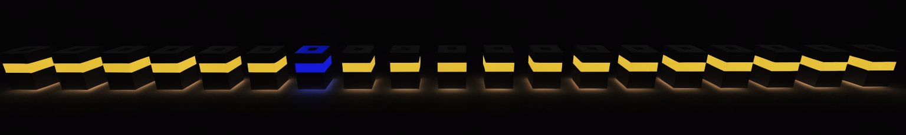

<p align="center">
  
</p>

<p align="center"><em>A real flashlight for Minecraft. Smooth beam, honest shadows, blinding glare.</em></p>

<p align="center">
  
  
  
  
  
</p>

Every flashlight mod does the same trick: invisible light blocks chasing your crosshair, chunky relights, light leaking through walls. **Flashlight** doesn't. It ships its own shader-driven light engine — a smooth volumetric cone that updates every frame, stops at walls, casts soft shadows and blinds anyone who looks into the lens. Built as the companion to **[Enhanced Darkness](https://github.com/EntonioDMI/enhanced-darkness)**: in its pitch black you'll need one.



## ✦ Two lights, two jobs

|  | 🔦 Flashlight | 💡 Work Lantern |
| --- | --- | --- |
| Role | cheap all-rounder | expensive floodlight |
| Beam | **scroll to focus the lens**: wide 25-block flood ↔ razor-thin **150-block** spot | fixed ~40° wall of light, 55 blocks |
| Power | AA battery — 30 min | battery pack — 45 min |
| Recipe | iron + redstone + glass | gold, iron, redstone block |

- **Right-click** — on/off. **R** — slam a fresh battery in, gun-reload style, with a chest-pull animation.
- **Mouse wheel** (flashlight on) — zoom the lens: floodlight for corridors, sniper beam for scouting.
- Batteries are consumables. Below 20% charge the beam visibly dies — reload or walk in the dark.



## ✦ The engine

No light blocks. No chunk relights. The cone is computed **inside the game's core shaders** — terrain, entities, dropped items, particles and even vanilla mob shadow blobs are cloned on the fly with the beam math injected. That means:

- **Instant** — the light moves the frame you move, with a subtle hand-lag inertia like a real torch.
- **Honest** — light is `albedo × cone`: real textures, real colours, zero noise, works in absolute darkness.
- **Blocked by walls** — a 48³ voxel map around the camera is ray-marched (DDA) per pixel; soft penumbra from three jittered rays, entities cast soft sphere shadows, and the beam *dissolves* vanilla shadow circles it hits.
- **Multiplayer-native** — up to four beams at once; everyone sees everyone's light, zoom level included.
- **Blinding** — glare is physics, not a sprite: its strength equals the actual cone intensity at *your* eyes, traced past blocks and mobs. Look into a lens up close and the screen whites out.


## ✦ Installation

1. Install **[Fabric Loader](https://fabricmc.net/use/)** for Minecraft **26.1.x**.
2. Install **[Fabric API](https://modrinth.com/mod/fabric-api)**.
3. Run **Java 25**.
4. Drop the jar into `mods` — on the client *and* the server (items and batteries are real).
5. Pairs best with **[Enhanced Darkness](https://github.com/EntonioDMI/enhanced-darkness)**.


## ✦ Building from source

```bash
./gradlew build      # jar lands in build/libs
./gradlew runClient  # dev client
```

## ✦ License

MIT
